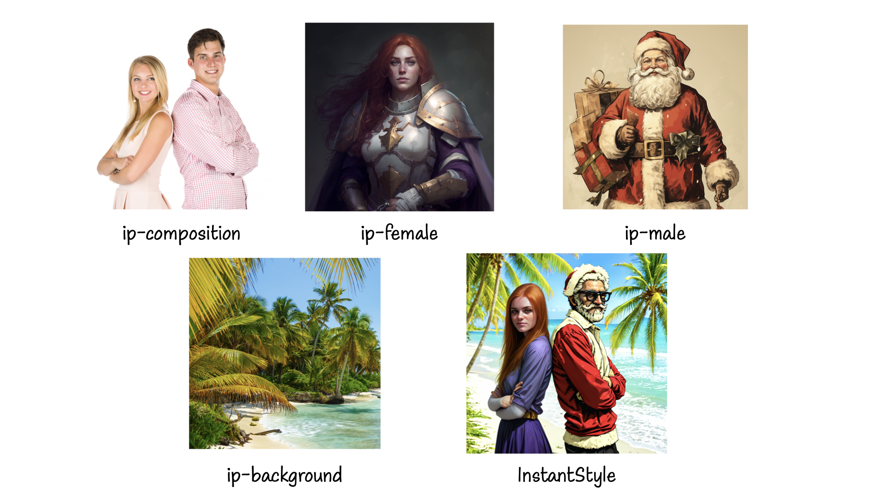

<div align="center">
<h1>InstantStyle: Free Lunch towards Style-Preserving in Text-to-Image Generation</h1>

[**Haofan Wang**](https://haofanwang.github.io/)<sup>*</sup> · [**Matteo Spinelli**](https://github.com/cubiq) · [**Qixun Wang**](https://github.com/wangqixun) · [**Xu Bai**](https://huggingface.co/baymin0220) · [**Zekui Qin**](https://github.com/ZekuiQin) · [**Anthony Chen**](https://antonioo-c.github.io/)

InstantX Team 

<sup>*</sup>corresponding authors

<a href='https://instantstyle.github.io/'></a>
<a href='https://arxiv.org/abs/2404.02733'></a>
[](https://huggingface.co/spaces/InstantX/InstantStyle)
[](https://modelscope.cn/studios/instantx/InstantStyle/summary)
[](https://github.com/InstantStyle/InstantStyle)

</div>

InstantStyle is a general framework that employs two straightforward yet potent techniques for achieving an effective disentanglement of style and content from reference images.

<!--  -->

<div align="center">

</div>


## Principle

Separating Content from Image. Benefit from the good characterization of CLIP global features, after subtracting the content text fea- tures from the image features, the style and content can be explicitly decoupled. Although simple, this strategy is quite effective in mitigating content leakage.
<p align="center">
  
</p>

Injecting into Style Blocks Only. Empirically, each layer of a deep network captures different semantic information the key observation in our work is that there exists two specific attention layers handling style. Specifically, we find up blocks.0.attentions.1 and down blocks.2.attentions.1 capture style (color, material, atmosphere) and spatial layout (structure, composition) respectively.
<p align="center">
  
</p>

## Release
- [2024/07/06] 🔥 We release [CSGO](https://github.com/instantX-research/CSGO) page for content-style composition. Code will be released soon.
- [2024/07/01] 🔥 We release [InstantStyle-Plus](https://instantstyle-plus.github.io/) report for content preserving.
- [2024/04/29] 🔥 We support InstantStyle natively in diffusers, usage can be found [here](https://github.com/InstantStyle/InstantStyle?tab=readme-ov-file#use-in-diffusers)
- [2024/04/24] 🔥 InstantStyle for fast generation, find demos at [InstantStyle-SDXL-Lightning](https://huggingface.co/spaces/radames/InstantStyle-SDXL-Lightning) and [InstantStyle-Hyper-SDXL](https://huggingface.co/spaces/radames/InstantStyle-Hyper-SDXL).
- [2024/04/24] 🔥 We support [HiDiffusion](https://github.com/megvii-research/HiDiffusion) for generating highres images, find more information [here](https://github.com/InstantStyle/InstantStyle/tree/main?tab=readme-ov-file#high-resolution-generation).
- [2024/04/23] 🔥 InstantStyle has been natively supported in diffusers, more information can be found [here](https://github.com/huggingface/diffusers/pull/7668).
- [2024/04/20] 🔥 InstantStyle is supported in [Mikubill/sd-webui-controlnet](https://github.com/Mikubill/sd-webui-controlnet/discussions/2770).
- [2024/04/11] 🔥 We add the experimental distributed inference feature. Check it [here](https://github.com/InstantStyle/InstantStyle?tab=readme-ov-file#distributed-inference).
- [2024/04/10] 🔥 We support an [online demo](https://modelscope.cn/studios/instantx/InstantStyle/summary) on ModelScope.
- [2024/04/09] 🔥 We support an [online demo](https://huggingface.co/spaces/InstantX/InstantStyle) on Huggingface.
- [2024/04/09] 🔥 We support SDXL-inpainting, more information can be found [here](https://github.com/InstantStyle/InstantStyle/blob/main/infer_style_inpainting.py).
- [2024/04/08] 🔥 InstantStyle is supported in [AnyV2V](https://tiger-ai-lab.github.io/AnyV2V/) for stylized video-to-video editing, demo can be found [here](https://twitter.com/vinesmsuic/status/1777170927500787782).
- [2024/04/07] 🔥 We support image-based stylization, more information can be found [here](https://github.com/InstantStyle/InstantStyle/blob/main/infer_style_controlnet.py).
- [2024/04/07] 🔥 We support an experimental version for SD1.5, more information can be found [here](https://github.com/InstantStyle/InstantStyle/blob/main/infer_style_sd15.py).
- [2024/04/03] 🔥 InstantStyle is supported in [ComfyUI_IPAdapter_plus](https://github.com/cubiq/ComfyUI_IPAdapter_plus) developed by our co-author.
- [2024/04/03] 🔥 We release the [technical report](https://arxiv.org/abs/2404.02733).

## Demos

### Stylized Synthesis

<p align="center">
  
  
</p>

### Image-based Stylized Synthesis

<p align="center">
  
</p>

### Comparison with Previous Works

<p align="center">
  
</p>

## Download
Follow [IP-Adapter](https://github.com/tencent-ailab/IP-Adapter?tab=readme-ov-file#download-models) to download pre-trained checkpoints from [here](https://huggingface.co/h94/IP-Adapter).

```
git clone https://github.com/InstantStyle/InstantStyle.git
cd InstantStyle

# download the models
git lfs install
git clone https://huggingface.co/h94/IP-Adapter
mv IP-Adapter/models models
mv IP-Adapter/sdxl_models sdxl_models
```

## Usage

Our method is fully compatible with [IP-Adapter](https://github.com/tencent-ailab/IP-Adapter). For feature subtraction, it only works for global feature instead of patch features. For SD1.5, you can find a demo at [infer_style_sd15.py](https://github.com/InstantStyle/InstantStyle/blob/main/infer_style_sd15.py), but we find that SD1.5 has weaker perception and understanding of style information, thus this demo is experimental only. All block names can be found in [attn_blocks.py](https://github.com/InstantStyle/InstantStyle/blob/main/attn_blocks.py) and [attn_blocks_sd15.py](https://github.com/InstantStyle/InstantStyle/blob/main/attn_blocks_sd15.py) for SDXL and SD1.5 respectively.

```python
import torch
from diffusers import StableDiffusionXLPipeline
from PIL import Image

from ip_adapter import IPAdapterXL

base_model_path = "stabilityai/stable-diffusion-xl-base-1.0"
image_encoder_path = "sdxl_models/image_encoder"
ip_ckpt = "sdxl_models/ip-adapter_sdxl.bin"
device = "cuda"

# load SDXL pipeline
pipe = StableDiffusionXLPipeline.from_pretrained(
    base_model_path,
    torch_dtype=torch.float16,
    add_watermarker=False,
)

# reduce memory consumption
pipe.enable_vae_tiling()

# load ip-adapter
# target_blocks=["block"] for original IP-Adapter
# target_blocks=["up_blocks.0.attentions.1"] for style blocks only
# target_blocks = ["up_blocks.0.attentions.1", "down_blocks.2.attentions.1"] # for style+layout blocks
ip_model = IPAdapterXL(pipe, image_encoder_path, ip_ckpt, device, target_blocks=["up_blocks.0.attentions.1"])

image = "./assets/0.jpg"
image = Image.open(image)
image.resize((512, 512))

# generate image variations with only image prompt
images = ip_model.generate(pil_image=image,
                            prompt="a cat, masterpiece, best quality, high quality",
                            negative_prompt= "text, watermark, lowres, low quality, worst quality, deformed, glitch, low contrast, noisy, saturation, blurry",
                            scale=1.0,
                            guidance_scale=5,
                            num_samples=1,
                            num_inference_steps=30, 
                            seed=42,
                            #neg_content_prompt="a rabbit",
                            #neg_content_scale=0.5,
                          )

images[0].save("result.png")
```

## Use in diffusers
InstantStyle has already been integrated into [diffusers](https://huggingface.co/docs/diffusers/main/en/using-diffusers/ip_adapter#style--layout-control) (please make sure that you have installed diffusers>=0.28.0.dev0), making the usage significantly simpler. You can now control the per-transformer behavior of each IP-Adapter with the set_ip_adapter_scale() method, using a configuration dictionary as shown below:

```python
from diffusers import StableDiffusionXLPipeline
from PIL import Image
import torch

# load SDXL pipeline
pipe = StableDiffusionXLPipeline.from_pretrained(
    "stabilityai/stable-diffusion-xl-base-1.0",
    torch_dtype=torch.float16,
    add_watermarker=False,
)

# load ip-adapter
pipe.load_ip_adapter("h94/IP-Adapter", subfolder="sdxl_models", weight_name="ip-adapter_sdxl.bin")
pipe.enable_vae_tiling()

# configure ip-adapter scales.
scale = {
    "down": {"block_2": [0.0, 1.0]},
    "up": {"block_0": [0.0, 1.0, 0.0]},
}
pipeline.set_ip_adapter_scale(scale)
```

In this example. We set ```scale=1.0``` for IP-Adapter in the second transformer of down-part, block 2, and the second in up-part, block 0. Note that there are 2 transformers in down-part block 2 so the list is of length 2, and so do the up-part block 0. The rest IP-Adapter will have a zero scale which means disable them in all the other layers.

With the help of ```set_ip_adapter_scale()```, we can now configure IP-Adapters without a need of reloading them everytime we want to test the IP-Adapter behaviors.

```python
# for original IP-Adapter
scale = 1.0
pipeline.set_ip_adapter_scale(scale)

# for style blocks only
scale = {
    "up": {"block_0": [0.0, 1.0, 0.0]},
}
pipeline.set_ip_adapter_scale(scale)
```

### Multiple IP-Adapter images with masks
You can also load multiple IP-Adapters, together with multiple IP-Adapter images with masks for more precisely layout control just as that in [IP-Adapter](https://huggingface.co/docs/diffusers/main/en/using-diffusers/ip_adapter#ip-adapter-masking) do.

```python
from diffusers import StableDiffusionXLPipeline
from diffusers.image_processor import IPAdapterMaskProcessor
from transformers import CLIPVisionModelWithProjection
from PIL import Image
import torch

image_encoder = CLIPVisionModelWithProjection.from_pretrained(
    "h94/IP-Adapter", subfolder="models/image_encoder", torch_dtype=torch.float16
).to("cuda")

pipe = StableDiffusionXLPipeline.from_pretrained(
    "RunDiffusion/Juggernaut-XL-v9", torch_dtype=torch.float16, image_encoder=image_encoder, variant="fp16"
).to("cuda")

pipe.load_ip_adapter(
    ["ostris/ip-composition-adapter", "h94/IP-Adapter"],
    subfolder=["", "sdxl_models"],
    weight_name=[
        "ip_plus_composition_sdxl.safetensors",
        "ip-adapter_sdxl_vit-h.safetensors",
    ],
    image_encoder_folder=None,
)

scale_1 = {
    "down": [[0.0, 0.0, 1.0]],
    "mid": [[0.0, 0.0, 1.0]],
    "up": {"block_0": [[0.0, 0.0, 1.0], [1.0, 1.0, 1.0], [0.0, 0.0, 1.0]], "block_1": [[0.0, 0.0, 1.0]]},
}
# activate the first IP-Adapter in everywhere in the model,
# configure the second one for precise style control to each masked input.
pipe.set_ip_adapter_scale([1.0, scale_1])

processor = IPAdapterMaskProcessor()
female_mask = Image.open("./assets/female_mask.png")
male_mask = Image.open("./assets/male_mask.png")
background_mask = Image.open("./assets/background_mask.png")
composition_mask = Image.open("./assets/composition_mask.png")
mask1 = processor.preprocess([composition_mask], height=1024, width=1024)
mask2 = processor.preprocess([female_mask, male_mask, background_mask], height=1024, width=1024)
mask2 = mask2.reshape(1, mask2.shape[0], mask2.shape[2], mask2.shape[3])   # output -> (1, 3, 1024, 1024)

ip_female_style = Image.open("./assets/ip_female_style.png")
ip_male_style = Image.open("./assets/ip_male_style.png")
ip_background = Image.open("./assets/ip_background.png")
ip_composition_image = Image.open("./assets/ip_composition_image.png")

image = pipe(
    prompt="high quality, cinematic photo, cinemascope, 35mm, film grain, highly detailed",
    negative_prompt="",
    ip_adapter_image=[ip_composition_image, [ip_female_style, ip_male_style, ip_background]],
    cross_attention_kwargs={"ip_adapter_masks": [mask1, mask2]},
    guidance_scale=6.5,
    num_inference_steps=25,
).images[0]
image

```

<p align="center">
  
</p>

## High Resolution Generation
We employ [HiDiffusion](https://github.com/megvii-research/HiDiffusion) to seamlessly generate high-resolution images, you can install via `pip install hidiffusion`.

```python
from hidiffusion import apply_hidiffusion, remove_hidiffusion

# reduce memory consumption
pipe.enable_vae_tiling()

# apply hidiffusion with a single line of code.
apply_hidiffusion(pipe)

...

# generate image at higher resolution
images = ip_model.generate(pil_image=image,
                           prompt="a cat, masterpiece, best quality, high quality",
                           negative_prompt= "text, watermark, lowres, low quality, worst quality, deformed, glitch, low contrast, noisy, saturation, blurry",
                           scale=1.0,
                           guidance_scale=5,
                           num_samples=1,
                           num_inference_steps=30, 
                           seed=42,
                           height=2048,
                           width=2048
                          )
```

## Distributed Inference
On distributed setups, you can run inference across multiple GPUs with 🤗 Accelerate or PyTorch Distributed, which is useful for generating with multiple prompts in parallel, in case you have limited VRAM on each GPU. More information can be found [here](https://huggingface.co/docs/diffusers/main/en/training/distributed_inference#device-placement). Make sure you have installed diffusers from the source and the lastest accelerate.

```python
max_memory = {0:"10GB", 1:"10GB"}
pipe = StableDiffusionXLPipeline.from_pretrained(
    base_model_path,
    torch_dtype=torch.float16,
    add_watermarker=False,
    device_map="balanced",
    max_memory=max_memory
)
```

## Start a local gradio demo <a href='https://github.com/gradio-app/gradio'></a>
Run the following command:
```sh
git clone https://github.com/InstantStyle/InstantStyle.git
cd ./InstantStyle/gradio_demo/
pip install -r requirements.txt
python app.py
```

## Resources
- [InstantStyle for WebUI](https://github.com/Mikubill/sd-webui-controlnet/discussions/2770)
- [InstantStyle for ComfyUI](https://github.com/cubiq/ComfyUI_IPAdapter_plus)
- [InstantID](https://github.com/InstantID/InstantID)

## Disclaimer
The pretrained checkpoints follow the license in [IP-Adapter](https://github.com/tencent-ailab/IP-Adapter?tab=readme-ov-file#download-models). Users are granted the freedom to create images using this tool, but they are obligated to comply with local laws and utilize it responsibly. The developers will not assume any responsibility for potential misuse by users.

## Acknowledgements
InstantStyle is developed by the InstantX team and is highly built on [IP-Adapter](https://github.com/tencent-ailab/IP-Adapter), which has been unfairly compared by many other works. We at InstantStyle make IP-Adapter great again. Additionally, we acknowledge [Hu Ye](https://github.com/xiaohu2015) for his valuable discussion.

## Star History
[](https://star-history.com/#InstantStyle/InstantStyle&Date)

## Cite
If you find InstantStyle useful for your research and applications, please cite us using this BibTeX:

```bibtex
@article{wang2024instantstyle,
  title={InstantStyle-Plus: Style Transfer with Content-Preserving in Text-to-Image Generation},
  author={Wang, Haofan and Xing, Peng and Huang, Renyuan and Ai, Hao and Wang, Qixun and Bai, Xu},
  journal={arXiv preprint arXiv:2407.00788},
  year={2024}
}

@article{wang2024instantstyle,
  title={InstantStyle: Free Lunch towards Style-Preserving in Text-to-Image Generation},
  author={Wang, Haofan and Wang, Qixun and Bai, Xu and Qin, Zekui and Chen, Anthony},
  journal={arXiv preprint arXiv:2404.02733},
  year={2024}
}
```

For any question, feel free to contact us via haofanwang.ai@gmail.com.
